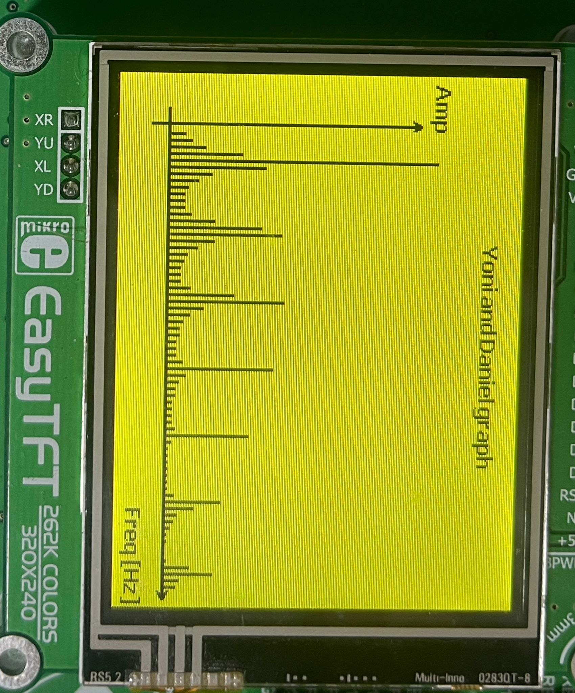

# Real-Time Spectrum Analyzer

## Project Overview

This project implements a **real-time spectrum analyzer** using a PIC32 microcontroller, ILI9341 TFT display, and an Arduino Due as a signal generator and secondary processing unit. It was developed as part of the **RT DSP course**.

---

## Features

* **256-point FFT implementation**
* Real-time ADC sampling with interrupt-based processing
* Graphical spectrum display with amplitude columns and axes
* Input from Arduino Due DAC1 output to PIC32 AN0
* Arduino Due used for generating test signals (sine, square, ramp) with variable frequencies and additional waveform processing (3 signals: sine, square, ramp)
* **Sampling Status LEDs:** One LED indicates sampling in progress, and another LED indicates sampling completion

---

## Programming Languages Used

* **C** (for both PIC32 code using mikroC PRO and Arduino Due code using Arduino IDE)

---

## Tools & Environment

* **PIC32** on EasyPIC Fusion v7
* **Arduino Due** (signal generator)
* **mikroC PRO for PIC32** (licensed version required)
* **Arduino IDE** (for programming the Arduino Due)
* **ILI9341 TFT display module**

---

## Installation & Setup

### 1. Hardware Connections

* **Arduino Due DAC1 → PIC32 AN0** input pin
* **TFT ILI9341 connections** to PIC32 per EasyPIC Fusion v7 schematic (SPI interface)
* **Power supply**: Ensure both boards share common GND
* **LEDs connections**:  
  - LED1: indicates sampling in progress  
  - LED2: indicates sampling complete

### 2. Software Requirements

* mikroC PRO for PIC32 (with USB dongle or valid license)
* Arduino IDE (for uploading test signal code to Arduino Due)

### 3. Uploading Code

* Flash the PIC32 with [SpectrumAnalyzer.c](SpectrumAnalyzer.c) using mikroProg Suite.
* Upload the Arduino Due code [3signals.ino](3signals.ino) (3 signals generator) using Arduino IDE to generate test signals.


## File Structure

```
Spectrum-Analyzer-RTDSP/
├── README.md
├── SpectrumAnalyzer.c
├── 3signals.ino
├── Images/
│   ├── system_photo.jpeg
│   ├── SINUS_2_10.jpeg
│   ├── SINUS_2_40.jpeg
│   ├── SINUS_5_10.jpeg
│   ├── SINUS_5_40.jpeg
│   ├── SAWTOOTH_2_10.jpeg
│   ├── SAWTOOTH_2_40.jpeg
│   ├── SAWTOOTH_5_10.jpeg
│   ├── SAWTOOTH_5_40.jpeg
│   ├── PULSE_2_10.jpeg
│   ├── PULSE_2_40.jpeg
│   └── PULSE_5_10.jpeg
```


---

## System Photo


---

### Spectrum Results by Waveform, Amplitude, and Frequency

#### Sinusoidal Waveforms

* **Amplitude 2, Frequency 10Hz**  
  
  ---

* **Amplitude 2, Frequency 40Hz**  
  
  ---

* **Amplitude 5, Frequency 10Hz**  
  
  ---

* **Amplitude 5, Frequency 40Hz**  
  
  ---

#### Sawtooth Waveforms

* **Amplitude 2, Frequency 10Hz**  
  
  ---

* **Amplitude 2, Frequency 40Hz**  
  
  ---

* **Amplitude 5, Frequency 10Hz**  
  
  ---

* **Amplitude 5, Frequency 40Hz**  
  
  ---

#### Pulse Waveforms

* **Amplitude 2, Frequency 10Hz**  
  
  ---

* **Amplitude 2, Frequency 40Hz**  
  
  ---

* **Amplitude 5, Frequency 10Hz**  
  
  ---

* **Amplitude 5, Frequency 40Hz**  
  

---

## Project Code

### SpectrumAnalyzer.c

```c
// SpectrumAnalyzer.c
// Real-Time Spectrum Analyzer for PIC32
// Developed by Yehonatan Levi

#include <stdio.h>
#include <math.h>

// LED status indicators
// During sampling: LED1 ON
// After sampling complete: LED2 ON

int main() {
    // Initialization code
    // Configure LED1 and LED2 as outputs
    // ADC setup
    // Timer interrupts for sampling
    // Turn ON LED1 during sampling
    // FFT processing
    // Turn OFF LED1 and turn ON LED2 after sampling complete
    // Display output to ILI9341 TFT
    return 0;
}
```
### 3signals.ino  (3 signals generator)
```c
// 3signals.ino
// Arduino Due signal generator (3 signals: sine, square, ramp)
// Developed by Yehonatan Levi

void setup() {
  // Initialize DAC1 output
}

void loop() {
  // Generate waveform (sine, square, ramp)
  // Output to DAC1 at set frequency
}
```
## License

This project uses **mikroC PRO for PIC32**, which requires a valid license to compile. Ensure you have appropriate licensing to use and modify this code.

---

## Credits

Developed by Yehonatan Levi and Daniel Cohen as part of the Real-Time DSP (RT DSP) course, 2025.
